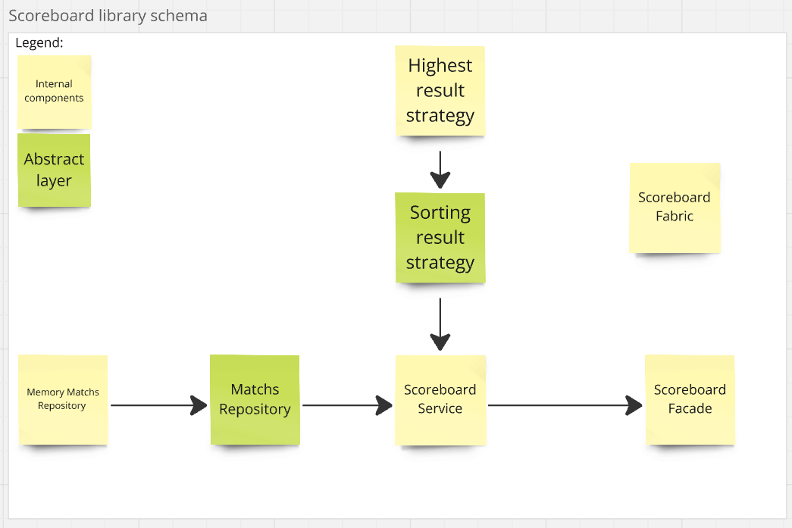

## Description

The **Live Football World Cup Scoreboard** is a library designed to track live scores of all ongoing matches in the
Football World Cup. It provides real-time updates and allows efficient management of match information. This project was
developed for a sports data company to ensure fast and easy access to match results.

## Table of Contents

- [Introduction](#introduction)
- [Architecture Overview](#architecture-overview)
    - [Application Structure](#application-structure)
    - [Key Components](#key-components)
    - [Architecture Diagram](#architecture-diagram)
- [Installation and Setup](#installation-and-setup)
- [Usage Examples](#usage-examples)

## Introduction

The application is designed as a simple library that enables real-time updates of football match scores. It provides
functionality to add new matches, display all ongoing games, update live scores, and mark matches as finished. The
library ensures an easy and efficient way to manage live football match data.

## Architecture Overview

The application is written in Java and designed to be used as a simple library. The development process followed the
principles of Test-Driven Development (TDD).

### Application Structure

The core of the application consists of a configuration class that includes a factory method called create. This class
acts as an Inversion of Control (IoC) container, responsible for injecting dependencies into components. This
approach allows for easy replacement of components, such as the database, without affecting the core functionality of
the application. While inspired by the principles of Hexagonal Architecture, the design avoids unnecessary complexity by
omitting additional layers of ports and adapters, which would overcomplicate such a simple application.

### Key Components

- **ScoreboardFacade** – The main entry point of the application. It handles all business use cases, including
  starting and finishing matches, updating scores, and displaying all currently ongoing games.
- **ScoreboardService** – A service responsible for executing business logic. The facade delegates operations to this
  component.
- **MatchsRepositor** – A storage mechanism for active matches. In the current implementation, it is an in-memory
  repository.
- **SortingResultStrategy** – Defines how matches are displayed. The current version sorts matches based on the highest
  total
  score.

This modular structure ensures flexibility, making it easy to swap out components like the repository or sorting
strategy without modifying the core logic.

### Architecture Diagram

Below is a visual representation of the application's architecture:

